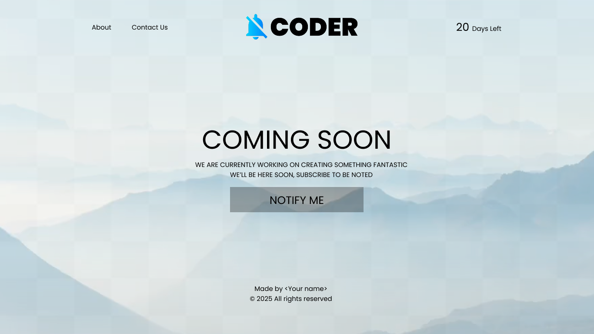

# 🎨 100 Days of Figma – Day 2

## 📌 Challenge
**Day 2: [Clean and Modern Coming Soon Page UI]**  
Today’s focus was on practicing layout alignment, consistent typography, and simple color usage to create a clean and minimal interface.

---

## 🛠️ Tools Used

- Figma
- Font: Poppins

---

## 🖼️ Preview

---

## 💡 What I Learned

- Proper use of auto layout
- Shadow and spacing consistency
- Responsive resizing in Figma

---

✨ Part of my [100 Days of Figma](https://github.com/tejashrree/100-Days-Of-Figma) challenge.
