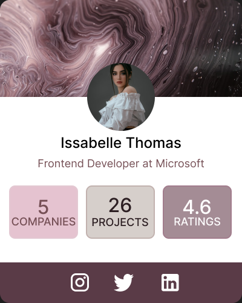

# 🎨 Day 03 - Figma UI Challenge | Profile Card Component

Welcome to Day 03 of my **#100DaysOfFigma** challenge!  
Today’s project is a **Profile Card UI Component** designed to be clean, elegant, and informative — perfect for portfolios, team sections, or networking apps.

## ✨ Project Highlights

- 👩‍💻 **Name**: Issabelle Thomas  
- 💼 **Role**: Frontend Developer at Microsoft  
- 🏢 **Companies**: 5  
- 🛠️ **Projects**: 26  
- ⭐ **Ratings**: 4.6  
- 🔗 **Socials**: Instagram, Twitter, LinkedIn icons included

## 📐 Design Goals

- Create a sleek and aesthetic **profile card**.
- Experiment with **contrast and minimalist layout**.
- Integrate **rounded elements** and **social icons** for a modern UI look.
- Practice **consistent spacing and visual hierarchy**.

## 🛠 Tools Used

- **Figma** – Design and prototyping
- **iconify** – Integrating social icons
- **Unsplash** – Profile + background image inspiration

## 🎯 Key Skills Practiced

- Card layout structuring
- Typography pairing
- Color palette harmony (blush, plum, and soft greys)
- Icon integration
- Shadowing and layering

## 📸 Preview

---

## 📁 Part of:

**[100 Days of Figma Challenge](https://github.com/tejashrree/100-Days-Of-Figma)**  
Feel free to ⭐ the repo or follow along my design journey!

