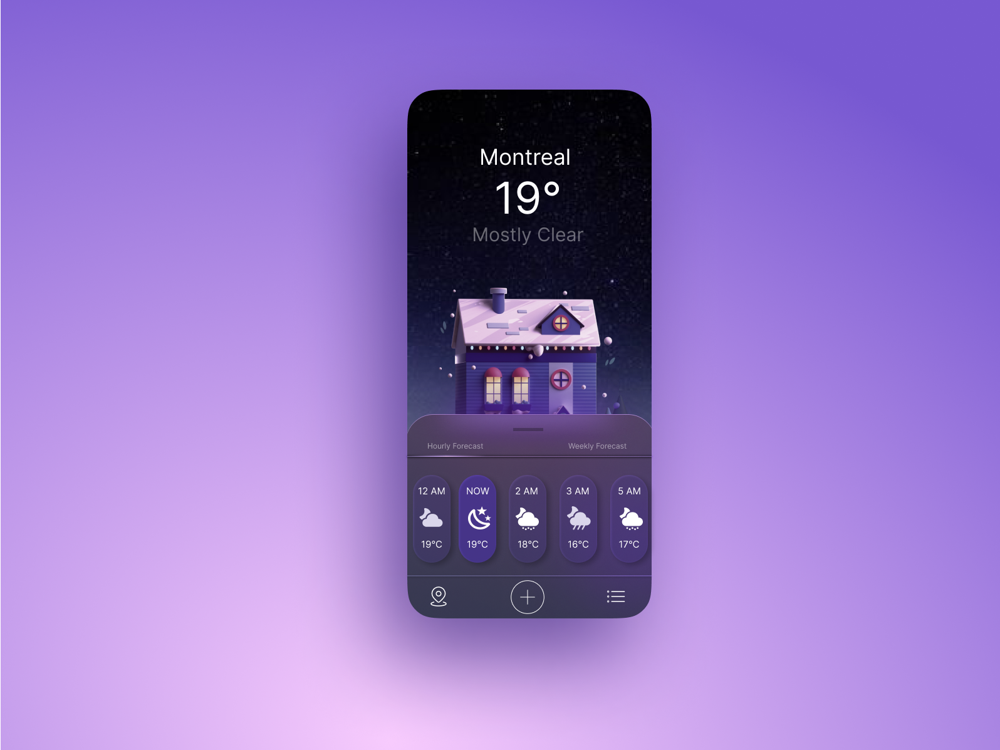

# 🌤️ Day 4 - Weather App UI Design | 100 Days of Figma Challenge

Welcome to Day 4 of my **100 Days of Figma Challenge**! 🎨  
Today’s task was to design a **Weather App UI** that’s clean, modern, and user-friendly. I focused on a cozy, night-time winter vibe set in Montreal. ☃️🌌

---

## 📱 Project Overview

- **Title:** Weather App UI – Montreal Forecast
- **Platform:** Mobile (iOS/Android)
- **Tools Used:** Figma
- **Challenge Theme:** UI for Weather Forecasting

---

## 🎯 Features

- 📍 Location-based forecast (Montreal)
- 🌡️ Temperature display (in °C)
- 🌤️ Condition status (e.g., "Mostly Clear")
- 🕓 Hourly forecast with weather icons & temperature
- 🏠 3D-style cozy house illustration with snow animation vibe
- 🔘 Tabbed navigation for "Hourly" and "Weekly" forecast
- ⚙️ Bottom navigation bar with:
  - Location
  - Add new city
  - Menu/settings

---

## ✨ Design Highlights

- **Glassmorphism style** for the forecast cards
- **Dark gradient background** for a night-time aesthetic
- **Soft shadows & vibrant icons** to enhance UX
- **Typography:** Clean and readable, keeping contrast in mind

---

## 📸 Screenshot

---

## 🔮 Learnings

- Practiced designing cards with rounded corners and depth
- Improved visual hierarchy using contrast and scale
- Worked on consistent iconography and spacing

---

🗓️ **#100DaysOfFigma** | **Day 4 Complete ✅**
